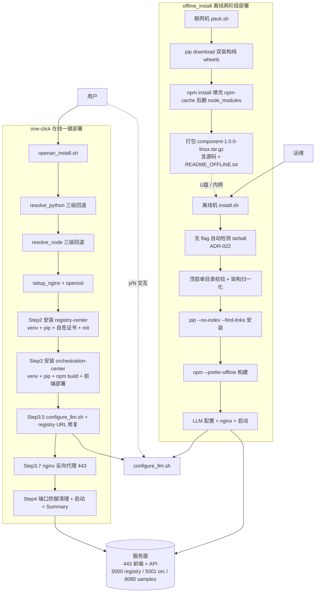
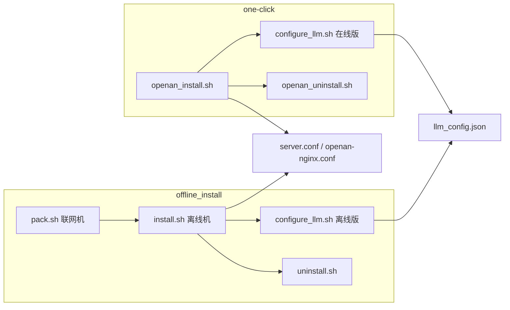
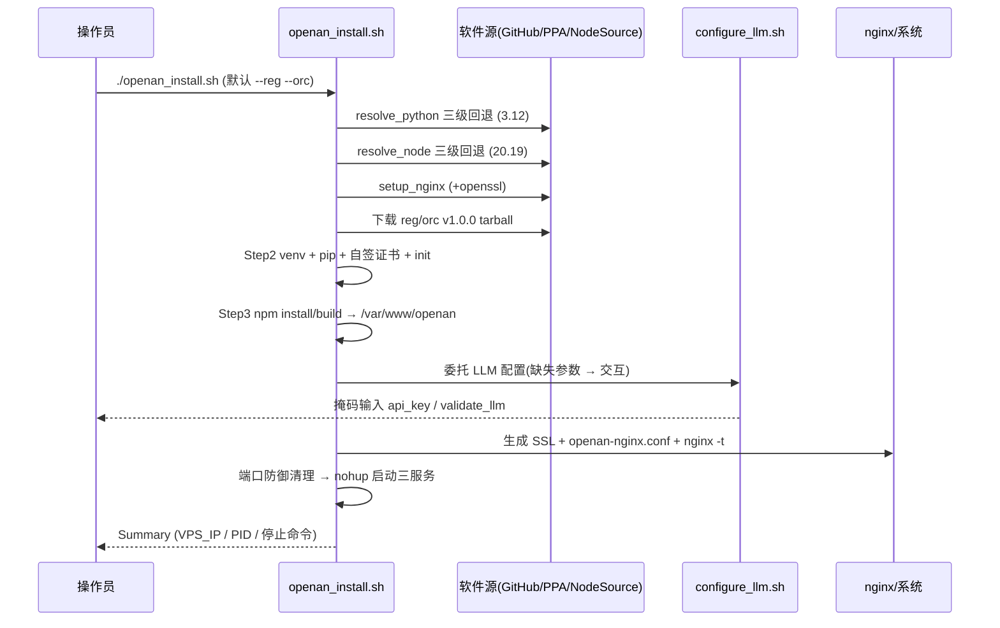
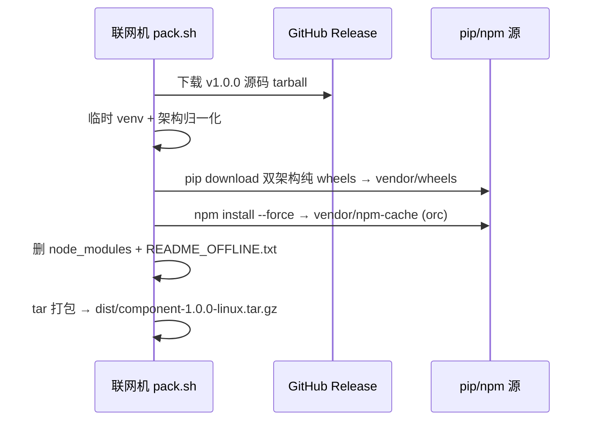
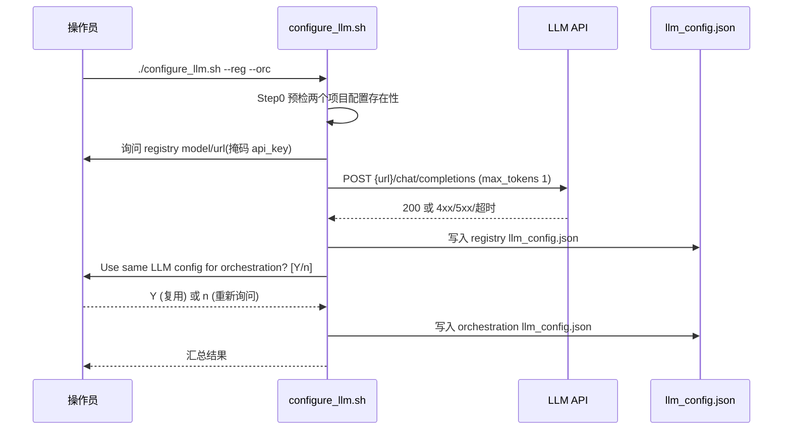

# 1、特性描述

本特性为 **OpenAN 平台二进制部署方案**,提供两条互补的部署路径,覆盖在线与断网两类环境:

- **one-click(在线一键部署)**: 在可联网的 Linux 主机上,通过 `openan_install.sh` 实时下载
  registry-center / orchestration-center 的 v1.0.0 源码 tarball 与运行时依赖,自动检测并安装
  Python 3.12+、Node.js 20.19+、nginx(三级回退策略),完成 Python venv 与 pip 依赖安装、
  前端工作流设计器构建、HTTPS 反向代理配置与全服务启动;`openan_uninstall.sh` 提供对称卸载。
- **offline_install(离线两阶段部署)**: 面向断网/受限网络环境。在联网机用 `pack.sh` 预打包
  (源码 tarball + 双架构 Python wheels + npm 依赖缓存),产物 `<component>-1.0.0-linux.tar.gz`
  经移动介质/内网拷贝至离线机,由 `install.sh` 完全离线安装
  (`pip --no-index`、`npm --prefer-offline`),`uninstall.sh` 对称卸载。
  离线模式**不**自动安装 Python/Node/nginx,离线机需预装(与 one-click 的关键差异)。
- **configure_llm.sh(公共 LLM 配置模块)**: 两个目录各有一份,flag 契约完全一致,独立配置
  registry-center 与 orchestration-center 的 `llm_config.json`,支持交互/非交互双模式。目前根据源码逻辑，不支持启动后再配置大模型，此处仅作为初始化调用的工具，若新版本大模型逻辑改变才可以在初始化之后改变大模型配置。

## 1.1、依赖组件

|组件|组件描述|可获得性|
|:---|:-------|:-------|
|Python 3.12+ | registry-center / orchestration-center backend 运行与 `agent_registry.init` 初始化 | one-click: 自动三级回退(已有命令 → apt/dnf → python-build-standalone 预编译);offline: 离线机预装(**必选**) |
|Node.js 20.19+ 与 npm | 前端工作流设计器构建(`npm install --force && npm run build`) | one-click: 自动三级回退(已有命令 → NodeSource → nodejs.org 预编译);offline: 离线机预装(**必选**,registry 单装可跳过) |
|nginx | HTTPS 反向代理入口与前端静态资源服务 | one-click: 自动 apt/dnf/yum 安装(含 EPEL 回退);offline: 离线机预装(**必选**) |
|openssl | 自签证书生成(registry 内部证书与 nginx SSL 证书) | one-click: 自动安装;offline: 离线机预装 |
|curl / tar | tarball 下载、解压、LLM API 验证请求 | 两路径预装(必选);`tar` 亦用于 tarball 顶层目录探测 |
|GitHub Release tarball | registry-center / orchestration-center `v1.0.0` 源码 | pack.sh: 联网打包机;one-click: 安装机联网 |
|python-build-standalone | Python 3.12 预编译独立二进制(one-click 第三级回退,`${WORK_DIR}/.python3.12`) | GitHub Releases 下载,需联网 |
|nodejs.org/dist | Node.js v20.19.0 预编译二进制(one-click 第三级回退,`${WORK_DIR}/.node`) | 官方分发站下载,需联网 |
|deadsnakes PPA / NodeSource `setup_20.x` | apt/dnf 第三方仓库回退,提供 Py 3.12 / Node 20 大版本 | 需联网 |
|pip / npm 软件源 | registry/orchestration 的 Python 依赖与前端 npm 依赖 | pack.sh 在联网机预下载为本地缓存;离线装机的两阶段均不再访问网络 |
|本地工具链(ss / lsof / fuser) | 端口占用检测与进程定位(卸载与启动前清理) | 系统自带或随发行版可选安装;优先级 ss → lsof → fuser |

## 1.2、License

- **部署脚本自身**(one-click 与 offline_install 各脚本): 仓库未声明 LICENSE,按项目现状不附加额外许可说明;
- **被部署组件**: registry-center、orchestration-center 按各自开源项目 License 分发与使用;
- **第三方运行时**: nginx(BSD-2-Clause)、Node.js(MIT)、Python(python-build-standalone, PSF License / MIT)。

# 2、需求场景威胁建模

本特性属部署工具,自身不承载业务数据,但其运行需要 root 权限、写入 LLM API key、并暴露
外部访问面(nginx 443),故按 STRIDE 思路对关键威胁场景建模如下:

|威胁类别|威胁场景|影响面|现有缓解措施|
|:-------|:-------|:-----|:-----------|
|Spoofing(冒充)|远程访问 nginx HTTPS 时,自签证书(CN=localhost)无法被浏览器/客户端信任|远程访问入口(443)|仅提示用户自行信任;后端全部绑定 127.0.0.1,证书不对外分发;文档建议在受控网络内使用 |
|Spoofing|registry 组件间通信依赖自签证书链(server.cer / trust.cer)|registry 内部 API|证书仅本机生成、本机分发;`trust.cer` 用于划归内部信任域;生产环境替换为企业 CA 链 |
|Tampering(篡改)|`llm_config.json`、`server.conf`、nginx 配置被非授权修改导致行为劫持|配置面|配置文件属 root/部署用户权限;nginx `-t` 校验;卸载按端口+cmdline 双重匹配防误伤(ADR-008) |
|Information Disclosure(泄露)|LLM API key 以明文写入 `llm_config.json`;`--api-key` 参数可能出现在 `ps` 输出与 shell history|凭据面|`read_masked` 掩码输入(支持退格)、`LLM_API_KEY` 环境变量回退、文档优先推荐 env 方式(ADR-005/010);key 仅存本机配置文件 |
|Information Disclosure|`server_key.pem` 私钥泄露可伪造 registry 身份|registry 内部信任域|`chmod 600` 收紧权限;证书目标准备时显式设置 |
|Denial of Service(拒绝服务)|外部对 443 的流量洪泛;本地端口冲突(8899-8907/26335/26336 被残留进程占用)|服务可用性|后端不对外监听;启动前 `free_port` + Sample Agent 端口集群防御清理(ADR-009);代理层无节流(接受为已知限制) |
|Elevation of Privilege(提权)|脚本以 sudo 执行包管理器安装与 /etc 写入,恶意依赖可能继承 root 上下文|宿主系统|安装来源固定(GitHub Release / 官方源);pip 依赖在 one-click 走在线源、offline 走打包机锁定产物(双架构纯 wheel,ADR-011/018);卸载保留环境工具,不触碰无关进程(ADR-007) |

**信任边界**: 系统内部(nginx → backend: 127.0.0.1)与外部(用户浏览器 → nginx: 0.0.0.0:443)
形成唯一跨信任域交互点;agent server(8080 管理端口)不配置 nginx 代理,远程不可达(ADR-004/ADR-014)。

# 3、特性设计

## 3.1、上下文/USE-CASE视图

本特性由 6 个脚本模块 + 2 个 configure_llm.sh 变体组成,两条部署路径共享同样的组件安装目标
(registry-center / orchestration-center)、flag 契约与服务端口,差异仅在依赖获取方式
(在线实时下载 vs 离线预打包)。

**USE-CASE 清单**:

|编号|USE-CASE|参与者|描述|
|:---|:-------|:-----|:---|
|UC1|在线全量安装|操作员|默认 `--reg --orc`,完整流水线安装两组件 + 前端 + nginx,含 LLM 配置提示与 Sample Agent 询问 |
|UC2|在线单组件安装|操作员|`--reg` 或 `--orc` 单选;`--orc` 时交互输入外部 registry URL;`--reg` 单装无 nginx 代理,摘要显示内网地址 |
|UC3|离线打包|联网机运维|`pack.sh` 下载源码并预收集双架构 wheels 与 npm 缓存,产出单组件 tar 包 |
|UC4|离线安装|离线机运维|`install.sh` 无 flag 自动检测 tarball,纯离线安装、配置与启动 |
|UC5|LLM 配置|操作员|`configure_llm.sh` 交互/非交互配置 model/url/api_key,含预检、复用、掩码与验证 |
|UC6|卸载|操作员|one-click / offline 两版卸载:预扫描确认、智能进程识别、清理配置与目录、保留环境工具 |

## 3.2、模块设计

|模块|脚本|职责|输入|输出|
|:---|:---|:---|:---|:---|
|在线安装编排 | `one-click/openan_install.sh` | 依赖自举(三级回退)、组件安装、nginx 配置、服务启动、Summary | CLI flags(`--reg/--orc/--sample/-h`) | 可运行服务;`${WORK_DIR}/registry-center`、`orchestration-center`、`/var/www/openan`、`/etc/nginx/conf.d/openan.conf` |
|在线卸载 | `one-click/openan_uninstall.sh` | 预扫描、进程/端口清理、nginx 停止、配置与目录清理 | `--force` | 还原安装前状态(保留环境工具) |
|离线打包 | `offline_install/pack.sh` | 源码下载、双架构 wheels 预收集、npm 缓存填充、tar 打包 | `--reg/--orc` | `dist/<component>-1.0.0-linux.tar.gz` |
|离线安装 | `offline_install/install.sh` | tarball 检测/解压、静默安装、配置与启动 | `--reg/--orc/--sample`(无 flag 自动检测) | 同在线安装产物 |
|离线卸载 | `offline_install/uninstall.sh` | 同在线卸载,目录定位改用 Glob 匹配版本化目录 | `--force` | 还原安装前状态 |
|LLM 配置(在线/离线变体) | `one-click/configure_llm.sh`、`offline_install/configure_llm.sh` | 预检、交互/非交互写入 `llm_config.json`、连接验证 | `--reg/--orc/--model/--url/--api-key/--validate/--no-validate` | 各项目 `llm_config.json` 更新 |

### 3.2.1、模块接口定义

**CLI 契约**(全模块共享,语义一致,ADR-010/ADR-021/ADR-022):

|flag|openan_install.sh|pack.sh|install.sh|uninstall.sh|configure_llm.sh|
|:---|:---|:---|:---|:---|:---|
|`--reg`|安装 registry-center|打包 registry-center|安装 registry-center|—|配置 registry-center |
|`--orc`|安装 orchestration-center|打包 orchestration-center|安装 orchestration-center|—|配置 orchestration-center |
|`--sample`|启动 sample agents server(8080)|—|同在线(自动检测模式下较晚校验)|—|—|
|`-h/--help`|✓|✓|✓|✓|✓|
|`--force`|—|—|—|跳过交互确认|—|
|`--model/--url/--api-key/--validate/--no-validate`|—|—|—|—|LLM 参数与验证开关 |
|默认行为|两者 | 两者 | **AUTO_DETECT(无 flag 自动检测)** | — | 两者 |
|已移除 flag|`--all/--register/--orchestrate`(报错引导)|`--all`(报错引导)|同 `--all`|—|`--project`(报错引导)|
|依赖约束|`--sample` 无 `--orc` 时自动禁用|—|`--sample` 无 `--orc` 时自动禁用|—|—|

**文件接口**:

|文件|读写方|说明|
|:---|:---|:---|
|`<proj>/common/config/llm_config.json` | configure_llm.sh 写;各 backend 读 | model/url/api_key 明文配置;在线版固定路径,离线版 Glob(`registry-center-*`、`orchestration-center-*`)定位(ADR-020) |
|`<proj>/etc/ssl/server.cer`、`trust.cer`、`server_key.pem` | 安装器生成、registry 读取 | registry 内部自签证书链;`server_key.pem` chmod 600 |
|`<proj>/etc/ssl/server.conf` | 安装器生成、registry 读取 | 含 `jwk_private_key_path=etc/ssl/server_key.pem`(安装期 sed 修复) |
|`/etc/nginx/conf.d/openan.conf`(及本地 openan-nginx.conf 副本) | 安装器写、nginx 读 | HTTPS 反代与静态资源路由(ADR-014) |
|`/etc/nginx/ssl/cert.pem`、`key.pem` | 安装器生成、nginx 读 | 自签证书,CN=localhost,365 天有效期 |
|`/var/www/openan/` | 安装器部署,nginx www-data 读 | 前端构建产物;chmod 755(解决 www-data 无法穿越 home 目录,ADR-014) |
|`dist/<component>-1.0.0-linux.tar.gz` | pack.sh 产、install.sh 消 | 离线包:源码 + `vendor/wheels`(双架构)+ `vendor/npm-cache` + `README_OFFLINE.txt`;顶层目录名含版本(ADR-019) |

**进程/端口契约**(registry/orchestration/samples 均绑定 127.0.0.1,仅 nginx 监听 0.0.0.0):

|端口|服务|说明|
|:---|:---|:---|
|443|nginx HTTPS 反代|唯一远程入口:`/`→前端 SPA(try_files 回退 index.html)、`/api/orchestrate/`→`http://127.0.0.1:5001/`、`/registry/`→`http://127.0.0.1:5000/`(`--orc` 单装时替换为用户外部 URL) |
|5000|registry-center backend | `python -m agent_registry.start`;`AGENT_REGISTRY_URL=http://127.0.0.1:5000`(双装时 https→http 自动修复) |
|5001|orchestration-center backend | `python -m orchestrate.start` |
|8080|sample agents server 管理端口 | `python -m samples.start_agents_server`,默认关闭 |
|8899-8907、26335、26336|11 个 sample agent 端口集群 | 单进程多端口;安装期防御清理(ADR-009) |

**环境变量接口**: `AGENT_REGISTRY_URL`(启动时导出,`--orc` 单装时为用户输入的原样 URL)、`LLM_API_KEY`(configure_llm.sh 的 key 回退来源,避免 shell history 泄露)。

## 3.3、 Story分解

按 USE-CASE 场景划分 6 个 Story。实现语言为 Bash(无类层次结构),故每个 Story 以
**功能描述 / 验收标准 / 接口清单** 三元组描述需求,并以时序图描述关键实现过程。

### 3.3.1 Story设计

#### Story 1 — 在线全量安装(UC1)

**功能描述**: 执行 `./openan_install.sh`(无 flag 即 `--reg --orc`),完成 Python/Node/nginx
三级回退自举 → registry-center 安装(venv、pip、CertificateGenerator 自签、`rm -rf data/`、
非交互 `agent_registry.init`)→ orchestration-center 安装(venv、pip、`npm install --force`、
`npm run build > frontend-build.log`、run_sudo 部署 `/var/www/openan/`)→ LLM 配置
(委托 configure_llm.sh,缺失时 y/N 提示)→ nginx 配置(生成 SSL、NGINX_EOF 模板部署、
删 Debian default site、`nginx -t`)→ 启动(free_port 防冲突、samples 端口防御清理、
nohup 后台、nginx systemctl 优先)→ 打印 Summary(VPS_IP 取自 `hostname -I` 首 IP,
含动态 PID/日志路径/停止命令)。

**验收标准**:
- 无 flag 执行后两组件均安装,`--sample` 未指定时 sample server 不启动;
- Python Spec: ≥3.12 判定通过(`major>=3 && minor>=12`);Node ≥20.19 ✓ 同理;
- registry 启动后端口 5000 被占用且进程 cmdline 匹配 `agent_registry`;orc 5001 同理;
- nginx 启动后 `curl -k https://<VPS_IP>/` 返回前端页面,`/api/orchestrate/` 与 `/registry/` 路由可达;
- Summary 明确输出 3 个服务的 PIDs、日志路径与停止命令;
- `--reg` 下载源为 GitHub Release tarball,解压后目录名 `registry-center/` 存在。

**接口清单**: CLI(`--reg --orc -h --sample`);文件(`llm_config.json`、`server.conf`、
`openan-nginx.conf`、`frontend-build.log`);进程(`agent_registry.start`、`orchestrate.start`);
端口(5000/5001/443/8080)。

#### Story 2 — 在线单组件安装(UC2)

**功能描述**: `--reg` 或 `--orc` 单选时的裁剪执行:组件级跳过(仅 reg 时跳过 Node.js
解析与前端构建、跳过 nginx 部署;仅 orc 时跳过 registry 安装)。`--orc` 单装时交互式
输入外部 registry URL(默认 `https://127.0.0.1:5000`),原样写入 `server.conf` 与
`AGENT_REGISTRY_URL`,nginx `/registry/` 的 proxy_pass sed 替换为用户 URL(自动补尾斜杠);
`--reg --orc --sample` 全量 + 启动 sample。`--sample` 且无 `--orc` 时打印 INFO 并禁用。

**验收标准**:
- `./openan_install.sh --reg` 不执行 Node / npm / nginx 相关步骤(日志无对应 Step),摘要无 https 远程入口行,服务地址显示 127.0.0.1;
- `./openan_install.sh --orc` 交互输入外部 URL 后,`server.conf` 与 `AGENT_REGISTRY_URL` 与输入完全一致(不做 https→http 修复);
- `./openan_install.sh --sample` 输出 "no effect without --orc" 且 `START_SAMPLE=false`;
- `--reg --orc --sample` 启动后端口 8080 与 8899-8907/26335/26336 集群被占用,进程 cmdline 匹配 `samples`;
- 已移除 flag(`--all/--register/--orchestrate`)给出 ERROR 与迁移提示并以非零码退出。

**接口清单**: CLI(四个 flag 的组合空间);文件(`server.conf`);变量(`AGENT_REGISTRY_URL`)。

#### Story 3 — 离线打包(UC3)

**功能描述**: 在联网机执行 `pack.sh [--reg|--orc]`(默认两者)。对每个目标组件:从 GitHub
Release 下载 v1.0.0 源码 tarball → 清理 `__pycache__`、初始化 `log/run/data` → 在临时 venv
(`mktemp /tmp/pack-openan-venv-XXXXXX`)中 `pip download --only-binary=:all:` 按 x86_64/aarch64
双架构 + 多 manylinux 标签(`manylinux_2_34/2_28/2_17/manylinux2014`)收集纯 wheels 至
`vendor/wheels/` → `npm install --force` 填充 `vendor/npm-cache/` 后删除 node_modules
(仅 orc)→ 生成 `README_OFFLINE.txt` → `tar` 打包为 `<component>-1.0.0-linux.tar.gz`
入 `dist/`。版本集中常量 `VERSION="1.0.0"`、`PYTHON_VERSION="3.12"`。

**验收标准**:
- 产物存在于 `dist/`,`tar -tzf` 顶层仅一个版本化目录(`registry-center-1.0.0-linux/` 等,ADR-019);
- `vendor/wheels/` 内同时存在 cp312-any 纯 wheel 与双架构 wheel,且无 `.whl` 之外多余包体(ADR-011/018);
- `pip download` 任一生效平台失败均以非零码退出(不吞错,ADR-018);
- `vendor/npm-cache/` 非空且源码内无 `node_modules` 泄漏;
- orc 包含构建所需全部 npm 依赖(全局搜索无缺失),`README_OFFLINE.txt` 描述安装前提
  (离线机需自备 Python 3.12+/Node 20.19+/nginx,ADR-020/021);
- `--all` 报错引导改用 `--reg --orc`。

**接口清单**: CLI(`--reg/--orc/--all 已移除`);文件产物(`dist/*.tar.gz`);网络(GitHub Release、pip/npm 源);常量(`VERSION`、`PYTHON_VERSION`)。

#### Story 4 — 离线安装(UC4)

**功能描述**: 在离线机执行 `install.sh`(无 flag 进入 AUTO_DETECT 模式,扫 `dist/` 及脚本
目录 tarball,找出什么装什么;两者皆无 exit 1,ADR-022)。Step1 前置检查(架构归一化 +
Python/Node/nginx/openssl,reg-only 跳过 Node/nginx;缺失打印清晰 ERROR 提示离线机须预装);
find_tarball → extract_tarball(顶层单目录校验 + 已存在时 y/N 覆盖询问);Step5 registry:
venv、`pip install --no-index --find-links` 指向本地 wheels;Step6 orc:venv、
`npm install --force --cache vendor/npm-cache --prefer-offline`、`npm run build`、
run_sudo 部署前端;Step7 LLM 配置 y/N 跳过 + configure_llm.sh(离线版 Glob 定位版本化目录,
venv Python 优先);Step9 端口防御清理 + 启动 + Summary。registry 安装同样执行证书生成、
data/ 清理与非交互 init。

**验收标准**:
- 无 flag 仅放 reg 包时只检测并安装 reg;两个包都放则装两个;无包则退出并提示;
- 全程无外网请求(pip 使用 `--no-index --find-links`、npm 使用 `--prefer-offline`+本地 cache);
- 对版本化目录的 venv/`llm_config.json`/`log/openan-nginx.conf` 定位全部命中(Glob);
- 架构不符(如 x86_64 包放到 aarch64 机)在 wheels 目录探测阶段报错且引导选择正确包;
- 交互确认(`overwrite? [y/N]`、`Configure LLM? [y/N]`)默认 N,回车不破坏既有安装;
- 产生的服务状态与 Story 1 验收标准一致。

**接口清单**: CLI(`--reg/--orc/--sample/--all 已移除`);文件(`dist/*.tar.gz`、
`vendor/wheels`、`vendor/npm-cache`、`llm_config.json`);进程/端口同 Story 1。

#### Story 5 — LLM 配置(UC5)

**功能描述**: `configure_llm.sh` 独立模块(one-click 与 offline 变体)。Step 0 预检
(ADR-012):目标项目 `llm_config.json` 不存在则 `[WARN]` 跳过,全部缺失 `exit 1`;
交互模式自动触发(ADR-010):`--model/--url/--api-key` 任一缺失即进入;`--reg --orc`
时先配 registry 再询问 "Use same LLM config for orchestration? [Y/n]" 复用;`read_masked`
掩码输入;API key 优先级 `--api-key` > `LLM_API_KEY`(非交互回退,交互作提示默认值);
`validate_llm` 发 chat/completions 测试请求(Bearer、max_tokens 1、connect-timeout 10 /
max-time 30),URL 自动补 `/chat/completions` 后缀,失败可重输或 `skip`;
全空输入视为跳过 `exit 0`(ADR-013);`--no-validate` 跳过验证;
`--project` 报错引导(GitHub 弃用旧 flag)。offline 变体以 Glob 定位版本化目录且优先
venv Python(注:后者为 `validate_llm` 执行环境)。

**验收标准**:
- 无参数执行 → 交互模式且预检提示不存在的项目;
- 非交互 `--model/--url/--api-key` 全给出 → 同值写入全部目标,且不发交互;
- `LLM_API_KEY` 与 `--api-key` 同时给出时优先 flag;环境变量取值不打印明文;
- 掩码输入后 `llm_config.json` 中的 api_key 与输入一致;
- 验证 401/404/超时均不写入配置(fail-close)并提示重输或 skip;
- 全空回车退出码为 0,不产生任何文件变更。

**接口清单**: CLI(7 个 flag + 2 个 mode);文件(`llm_config.json`,在线固定路径 / 离线 Glob);
环境变量(`LLM_API_KEY`);网络(LLM API 端点)。

#### Story 6 — 卸载(UC6)

**功能描述**: 两版卸载器(one-click 固定目录 / offline Glob 版本化目录)。`--force` 跳过
确认(`set -uo pipefail` 容错卸载);预扫描输出 SCAN_PROCESSES / SCAN_NGINX / SCAN_DIRS 三组
清单,交互 `Proceed? [y/N]` 默认 N;Step1 按 14 项端口数组(5000/5001/8080/8899-8907/26335/26336)
经 `find_pids_on_port`(ss → lsof → fuser 优先级)取 PID,再以 cmdline 匹配全局
`OPENAN_PATTERNS="agent_registry|orchestrate|samples"` 才 kill(SIGTERM→3s→SIGKILL,
ADR-008 防跨端口逃逸与误杀);Step2 nginx 三级停止回退(systemctl → nginx -s stop → pkill);
Step3 清理 `conf.d/openan.conf`、`/etc/nginx/ssl`、`/var/www/openan`、本地 openan-nginx.conf
副本(offline 用 Glob 匹配 `orchestration-center-*/log/openan-nginx.conf`);
Step4 删除项目目录(offline 匹配 `registry-center-*`、`orchestration-center-*`);
保留环境工具(`.python3.12`、`.node` 及系统级 Python/Node/npm/nginx/openssl,ADR-007)。

**验收标准**:
- 卸载后 5000/5001/8080/443 无相关进程;14 项端口清单中 agent 集群端口全部释放;
- cmdline 含 "python" 但无 pattern 的无关进程存活(不误杀);
- nginx 配置/SSL/静态资源与本地副本均被移除,`nginx -t` 通过(无残留 include);
- 项目目录删除后 `ls` 确认;离线版对版本化目录同样命中;
- 无 `--force` 时输入 n 则不执行任何变更;卸载过程任一单步失败(如无 root)不中断剩余清理;
- 环境工具目录(`.python3.12/`、`.node/`)保留可复用。

**接口清单**: CLI(`--force`);进程(SS/lsof/fuser + cmdline pattern);文件(nginx 配置三处 +
项目目录);常量(端口数组、`OPENAN_PATTERNS`)。

## 3.4、质量属性设计

### 3.4.1、性能规格

|规格名称|规格指标|
|:-------|:-------|
|内存占用(reg+orc+samples 稳态)|TBD(待实测)|
|启动时间(三服务 + nginx 就绪)|TBD(待实测)|
|响应时间(前端页面 / API 代理链路)|TBD(待实测)|
|离线包产物大小(单组件 tarball)|TBD(待实测)|
|在线安装时长(含依赖下载)|TBD(待实测)|
|离线安装时长(纯本地,无网络)|TBD(待实测)|
|LLM 配置验证请求耗时(`validate_llm`)|TBD(待实测)|

> 说明:当前阶段无实测数据,规格指标留待后续基准测试填充;设计上仅保证
> 安装时间与网络带宽线性相关(one-click)或与磁盘容量线性相关(offline)。

### 3.4.2、可靠性设计

- **依赖自举三级回退**(Python/Node):命令检测 → 包管理器(含 deadsnakes PPA / NodeSource /
  dnf module 回退)→ 预编译独立二进制(`.python3.12` / `.node`),逐级降级,全失败才报错,
  消除单点源失败;
- **失败不吞错**:pack.sh 的 `pip download` 在 `set -euo pipefail` 下失败即终止且
  **不**静默忽略(ADR-018),保证离线包完整性;install.sh 对超时/网络错误显式报错;
- **幂等与可重入**:`pip install`、`npm install --force`、free_port 杀旧起新、
  tarball 覆盖询问,重复执行不产生双进程/脏数据;registry 安装前 `rm -rf data/`
  防 Agent Card 残留(ADR-009);
- **校验前置**:nginx `nginx -t` 通过才重启;tarball 解压前做顶层单目录校验(ADR-019);
  wheels 版本与架构在 Step 前置检查强制(离线机预装前提);init 与 start 顺序固定;
- **端口冲突自愈**:启动前 free_port(ss→lsof→fuser)与 sample 集群 12 端口防御清理,
  避免残留进程抢占(ADR-009);
- **容错卸载**:`set -uo pipefail` + 逐块容错,单项失败(如权限)不阻塞其余清理(ADR-007)。

### 3.4.3、安全/韧性/隐私设计

- **最小暴露面**:backends 仅 bind 127.0.0.1,nginx 0.0.0.0:443 为唯一远程入口;
  sample agents 不代理远程不可达(ADR-004/014);
- **传输安全**:nginx HTTPS 自签证书(CN=localhost / 365 天);registry 内部自签链
  (CertificateGenerator, RSA/serverAuth)经 `etc/ssl` 分发,私钥 chmod 600;
- **凭据保护**:API key `read_masked` 掩码输入(支持退格,不落显示);`--api-key` 优先于
  `LLM_API_KEY` env;文档引导 env 方式避免 shell history/ps 泄露(ADR-005/010);
- **防误操作破坏**:卸载三重防线——端口 + cmdline pattern 双重匹配(ADR-008)、
  交互确认默认 N、`--force` 才跳过;安装与卸载均不触碰系统其他服务;
- **完整性**:安装来源固定 GitHub Release 与官方源;离线包由 pack.sh 一次锁定
  (双架构纯 wheels + npm cache),发行物不可被网络变更污染(ADR-011);源码 tarball
  版本化(ADR-016);
- **隐私**:不收集任何遥测/用户数据;日志不打印 api_key 明文与掩码输入结果。

### 3.4.4、兼容性设计

- **OS 矩阵**:Debian/Ubuntu 系(apt)、CentOS/RHEL/Rocky/Alma/openEuler 系(dnf/yum),
  经 `/etc/os-release` ID + ID_LIKE 检测;CenOS 需 epel-release(nginx);
- **架构归一化**:`uname -m` 统一为 x86_64 / aarch64(pack/install 双端,ADR-011),
  Node 预编译区分 x64/arm64;wheels 按 x86_64/aarch64 双标签族收集
  (`manylinux2014/2_17/2_28/2_34` 兼容 glibc 2.17+);
- **版本下界**:Python ≥3.12(且 <4 主版本)、Node ≥20.19(含 EOL 后仍可从 nodejs.org 获取
  历史预编译二进制);`check_python_version/check_node_version` 以 major/minor 数值比较;
- **包布局兼容**:wheels 目录探测 `vendor/wheels` → 旧布局 `wheels`(ADR-020);
  tarball 顶层版本化目录 + 单目录约束(ADR-019),新老包互认;
- **flag 演进**:旧 flag(`--all/--register/--orchestrate/--project`)保留报错引导,
  不静默失效;`--sample` 无 `--orc` 自动禁用并提示(ADR-021);
- **nginx 路径**:`find_nginx_binary` 覆盖 `command -v`、`/usr/sbin`、`/sbin`
  的 PATH 不对称场景(ADR-003);systemctl 与服务启动双轨兼容。

### 3.4.5、可服务性设计

- **Summary 一站输出**:安装/启动后打印 VPS_IP(hostname -I 首 IP,回退 localhost,
  ADR-004)、三服务动态 PID/日志路径/停止命令,供运维直接取用;
- **日志可观测**:前端构建日志 `frontend-build.log`;服务 nohup 后台日志;LLM 验证请求
  打印 URL(model 不打印 api_key);configure_llm.sh 交互提示默认值;
- **再配置通道**:部署后通过 `configure_llm.sh`(或离线版)随时修改 LLM 配置并逐项目验证;
  registry URL 变更经重新安装或手动编辑 `server.conf`;
- **卸载保留环境工具**:`/usr` 级 Python/Node/npm/nginx/openssl 与本地
  `.python3.12/.node` 均保留,便于重装与复用(ADR-007);
- **自包含目录**:本地安装目录(`.python3.12/`、`.node/`)无 sudo、无系统污染,
  删除即恢复(PATH 仅会话级前置)。

### 3.4.6、可测试性设计

- **函数级可测**:`check_python_version/check_node_version`、`find_nginx_binary`、
  `find_pids_on_port`、`validate_llm`、`find_tarball/extract_tarball` 均为纯函数化设计,
  可单测版本边界(如 3.11 vs 3.12、20.18 vs 20.19)与端口优先级;
- **验证即测试**:`nginx -t`、LLM 测试请求(最小负载 1 token / 10s 连接超时)、
  tarball 顶层计数探测、pip/npm 离线模式均为内建自检;
- **交互降级**:所有交互(y/N 询问、掩码输入、覆盖确认)在非 TTY 下可跳过或默认;
  `--help` 全量展示契约,便于静态检查;
- **CI 可行性**:可容器化验证(docker 内 devcontainer/`containerized/` 镜像跑 Debian/
  CentOS 双矩阵),离线二进制安装后执行冒烟(端口探测 + curl HTTPS + 配置断言);
- **清理断言**:卸载后断言端口全空、nginx 配置无残留、目录删除;`--force` 路径覆盖
  无交互执行分支(ADR-007)。

# 4、需求分解分配表

|序号|模块名称|Story名称|Story描述|
|:---|:-------|:--------|:--------|
|1|one-click|Story 1 在线全量安装(UC1)|openan_install.sh 默认 `--reg --orc`:三级回退自举、双组件安装、nginx 反代、启动与 Summary |
|2|one-click|Story 2 在线单组件安装(UC2)|`--reg/--orc` 单选裁剪、`--sample` 依赖校验、`--orc` 外部 registry URL 交互注入、旧 flag 报错引导 |
|3|offline_install|Story 3 离线打包(UC3)|pack.sh:源码下载、双架构纯 wheels、npm 缓存、版本化单目录 tar 产物 |
|4|offline_install|Story 4 离线安装(UC4)|install.sh:无 flag 自动检测、顶层单目录校验、`--no-index`/`--prefer-offline` 静默安装、配置与启动 |
|5|binary(one-click / offline_install)|Story 5 LLM 配置(UC5)|configure_llm.sh 双变体:预检、交互/非交互、掩码输入、验证、复用与跳过语义 |
|6|binary(one-click / offline_install)|Story 6 卸载(UC6)|两版 uninstall.sh:预扫描确认、智能进程识别(端口+pattern)、nginx 三级停止、清理与保留策略 |

# 5、修改日志

|版本|发布说明|
|:---|:-------|
|v1.0.0|初始版本:覆盖 one-click(openan_install.sh / openan_uninstall.sh / configure_llm.sh)与 offline_install(pack.sh / install.sh / uninstall.sh / configure_llm.sh)双部署路径,对齐 binary 部署包 v1.0.0 系列实现 |

# 6、参考目录

- [docs/glossary.md](docs/glossary.md) — 术语表(三级回退、安装模式、PATH 前置、智能进程识别、跨端口进程逃逸、Sample Agent 端口集群、双架构 Wheels 等)
- ADR 决策记录(`docs/ADR-*.md`):
  - ADR-001 nodejs 自动安装、ADR-002 模式感知 LLM 手动命令(已废弃)、ADR-003 nginx sbin 路径检测、ADR-004 VPS IP 摘要展示
  - ADR-005 LLM 配置独立脚本(configure_llm.sh)、ADR-006 编排中心内置 Agent 自注册、ADR-007 卸载脚本、ADR-008 跨端口进程逃逸
  - ADR-009 示例 Agent 端口集群、ADR-010 LLM 配置分开询问、ADR-011 跨架构离线打包、ADR-012 配置文件预检
  - ADR-013 交互空配置跳过、ADR-014 前端静态资源服务、ADR-016 打包脚本源码 tarball 下载、ADR-017 README 移除第三方 LLM 引用
  - ADR-018 移除 any-platform wheel 通道、ADR-019 统一包命名与顶层目录检测、ADR-020 离线包脚本合并、ADR-021 离线安装 --sample flag、ADR-022 无 flag 自动检测 tarball
- [one-click/README.md](one-click/README.md) — 在线一键部署使用说明
- [offline_install/README.md](offline_install/README.md) — 离线打包/安装使用说明
- 实现脚本:one-click/{openan_install.sh, openan_uninstall.sh, configure_llm.sh}、offline_install/{pack.sh, install.sh, uninstall.sh, configure_llm.sh}